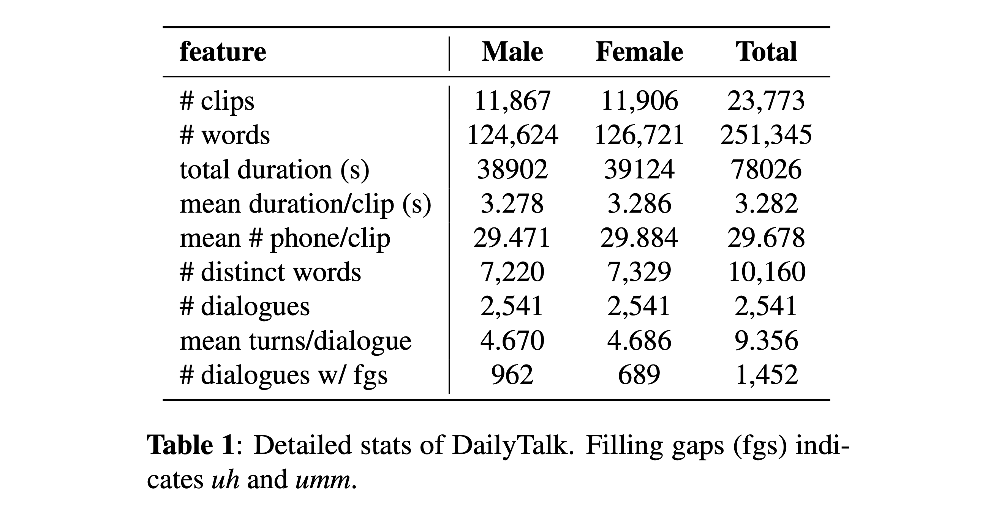
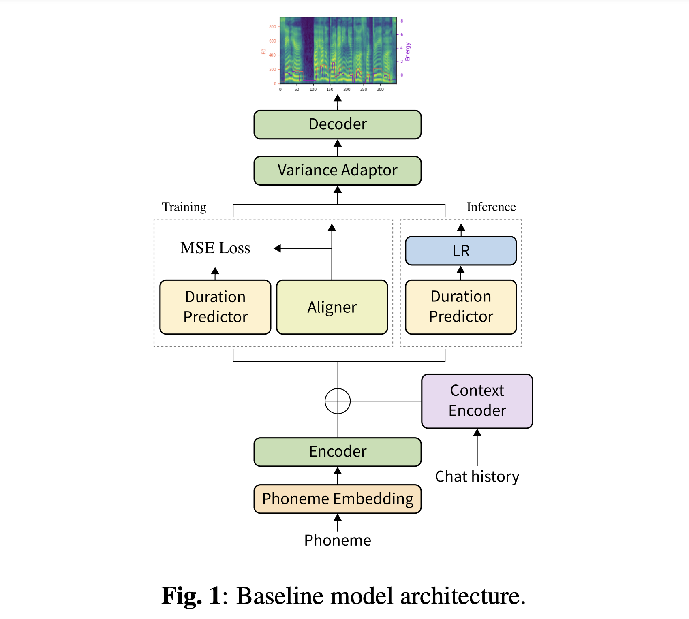
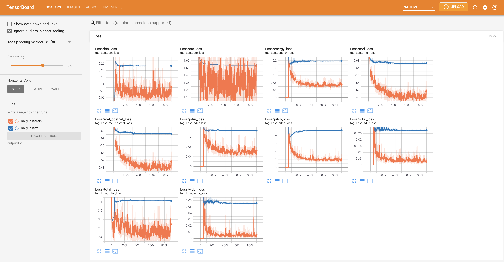
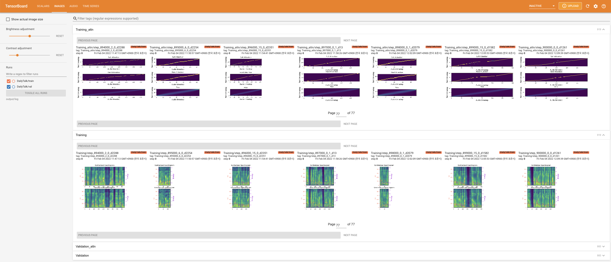
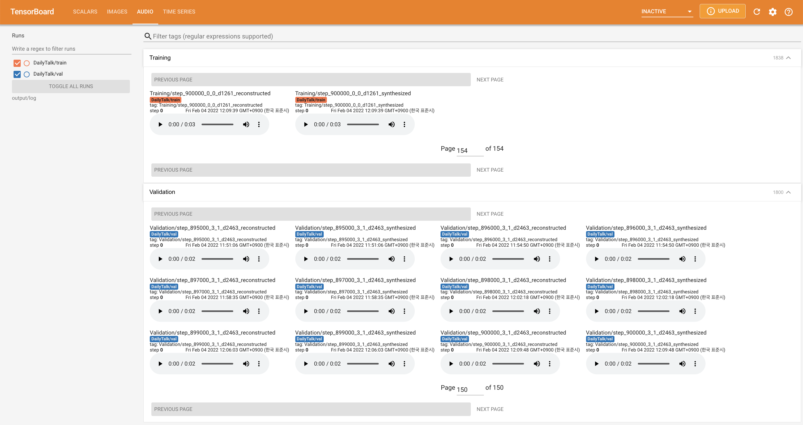

[](https://arxiv.org/abs/2207.01063)
# DailyTalk: Spoken Dialogue Dataset for Conversational Text-to-Speech

### Keon Lee<sup>\*</sup>, Kyumin Park<sup>\*</sup>, Daeyoung Kim

In our [paper](https://arxiv.org/abs/2207.01063), we introduce DailyTalk, a high-quality conversational speech dataset designed for Text-to-Speech.

<p align="center">
    
</p>

<p align="center">
    
</p>

**Abstract:** The majority of current Text-to-Speech (TTS) datasets, which are collections of individual utterances, contain few conversational aspects. In this paper, we introduce DailyTalk, a high-quality conversational speech dataset designed for conversational TTS. We sampled, modified, and recorded 2,541 dialogues from the open-domain dialogue dataset DailyDialog inheriting its annotated attributes. On top of our dataset, we extend prior work as our baseline, where a non-autoregressive TTS is conditioned on historical information in a dialogue. From the baseline experiment with both general and our novel metrics, we show that DailyTalk can be used as a general TTS dataset, and more than that, our baseline can represent contextual information from DailyTalk. The DailyTalk dataset and baseline code are freely available for academic use with CC-BY-SA 4.0 license.


# Dataset
You can download our [dataset](https://drive.google.com/drive/folders/1WRt-EprWs-2rmYxoWYT9_13omlhDHcaL). Please refer to [Statistic Details](https://github.com/keonlee9420/DailyTalk/tree/26239109fba7064a60ee02e5d4846152648142df#statistic-details) for details.

# Pretrained Models
You can download our [pretrained models](https://drive.google.com/drive/folders/1RrmWzJM1iWhQg2_wvDHlszVDJRV60Wfu?usp=sharing). There are two different directories: 'history_none' and 'history_guo'. The former has no historical encodings so that it is not a conversational context-aware model. The latter has historical encodings following [Conversational End-to-End TTS for Voice Agent](https://arxiv.org/abs/2005.10438) (Guo et al., 2020).

Toggle the type of history encodings by
```yaml
# In the model.yaml
history_encoder:
  type: "Guo" # ["none", "Guo"]
```


# Quickstart

## Dependencies
You can install the Python dependencies with
```
pip3 install -r requirements.txt
```
Also, `Dockerfile` is provided for `Docker` users.

## Inference

You have to download both [our dataset](https://drive.google.com/drive/folders/1WRt-EprWs-2rmYxoWYT9_13omlhDHcaL). Download [pretrained models](https://drive.google.com/drive/folders/1RrmWzJM1iWhQg2_wvDHlszVDJRV60Wfu?usp=sharing) and put them in `output/ckpt/DailyTalk/`. Also unzip `generator_LJSpeech.pth.tar` or `generator_universal.pth.tar` in hifigan folder. The models are trained with unsupervised duration modeling under transformer building block and the history encoding types.

Only the batch inference is supported as the generation of a turn may need contextual history of the conversation. Try

```
python3 synthesize.py --source preprocessed_data/DailyTalk/val_*.txt --restore_step RESTORE_STEP --mode batch --dataset DailyTalk
```
to synthesize all utterances in `preprocessed_data/DailyTalk/val_*.txt`.


# Training

## Preprocessing

- For a **multi-speaker TTS** with external speaker embedder, download [ResCNN Softmax+Triplet pretrained model](https://drive.google.com/file/d/1F9NvdrarWZNktdX9KlRYWWHDwRkip_aP) of [philipperemy's DeepSpeaker](https://github.com/philipperemy/deep-speaker) for the speaker embedding and locate it in `./deepspeaker/pretrained_models/`. Please note that our pretrained models are not trained with this (they are trained with `speaker_embedder: "none"`).
- Run 
  ```
  python3 prepare_align.py --dataset DailyTalk
  ```
  for some preparations.

  For the forced alignment, [Montreal Forced Aligner](https://montreal-forced-aligner.readthedocs.io/en/latest/) (MFA) is used to obtain the alignments between the utterances and the phoneme sequences.
  Pre-extracted alignments for the datasets are provided [here](https://drive.google.com/drive/folders/1fizpyOiQ1lG2UDaMlXnT3Ll4_j6Xwg7K?usp=sharing). 
  You have to unzip the files in `preprocessed_data/DailyTalk/TextGrid/`. Alternately, you can [run the aligner by yourself](https://montreal-forced-aligner.readthedocs.io/en/latest/user_guide/workflows/index.html). Please note that our pretrained models are not trained with supervised duration modeling (they are trained with `learn_alignment: True`).

  After that, run the preprocessing script by
  ```
  python3 preprocess.py --dataset DailyTalk
  ```

## Training

Train your model with
```
python3 train.py --dataset DailyTalk
```
Useful options:
- To use a [Automatic Mixed Precision](https://pytorch.org/tutorials/recipes/recipes/amp_recipe.html), append `--use_amp` argument to the above command.
- The trainer assumes single-node multi-GPU training. To use specific GPUs, specify `CUDA_VISIBLE_DEVICES=<GPU_IDs>` at the beginning of the above command.

# TensorBoard

Use
```
tensorboard --logdir output/log
```

to serve TensorBoard on your localhost.
The loss curves, synthesized mel-spectrograms, and audios are shown.





# Notes

- Convolutional embedding is used as [StyleSpeech](https://github.com/keonlee9420/StyleSpeech) for phoneme-level variance in unsupervised duration modeling. Otherwise, bucket-based embedding is used as [FastSpeech2](https://github.com/keonlee9420/Comprehensive-Transformer-TTS).
- Unsupervised duration modeling in phoneme-level will take longer time than frame-level since the additional computation of phoneme-level variance is activated at runtime.
- Two options for embedding for the **multi-speaker TTS** setting: training speaker embedder from scratch or using a pre-trained [philipperemy's DeepSpeaker](https://github.com/philipperemy/deep-speaker) model (as [STYLER](https://github.com/keonlee9420/STYLER) did). You can toggle it by setting the config (between `'none'` and `'DeepSpeaker'`).
- For vocoder, **HiFi-GAN** is used for all experiments in our paper.


# 1 prepare_align
```
python3 prepare_align.py --dataset DailyTalk
```

# 2 preprocess

1.  must to download the TextGrid files of dailytalk and put them in 'preprocessed_data/DailyTalk

2. 
```
python3 preprocess.py --dataset DailyTalk
```

# 3 extract_audio_emb

/home/ssz/miniconda3/envs/dailytalk/lib/python3.8/site-packages/huggingface_hub/constants.py
adjust line 60 and line 66 to "https://hf-mirror.com"
```
python extract_audio_emb.py
```
# 4 train
```
python3 train.py --dataset DailyTalk --use_amp
```
# 5 synthesize
```
python3 synthesize.py --source /home/ssz/TTS/DailyTalk/preprocessed_data/DailyTalk/val_frame.txt --restore_step 900000 --mode batch --dataset DailyTalk
```
# MOS eval
```
python mos_batch.py
```


# di yi ci shu shi hua liu cheng
```
cd ~/TTS/MyNewProject
git init                                  # 第一次初始化 Git
git remote add origin git@github.com:你的用户名/你的仓库名.git
git add .
git commit -m "Initial commit"
git branch -M main                        # 如果你还没创建 main 分支
git push -u origin main                   # 推送到 GitHub
```
# yi hou 
```
rm -rf .git  # 删除 Git 历史
cd ~/TTS/MyNewProject        # 进入项目
git add .
git commit -m "描述你改了什么"
git push                     # 推送代码
```